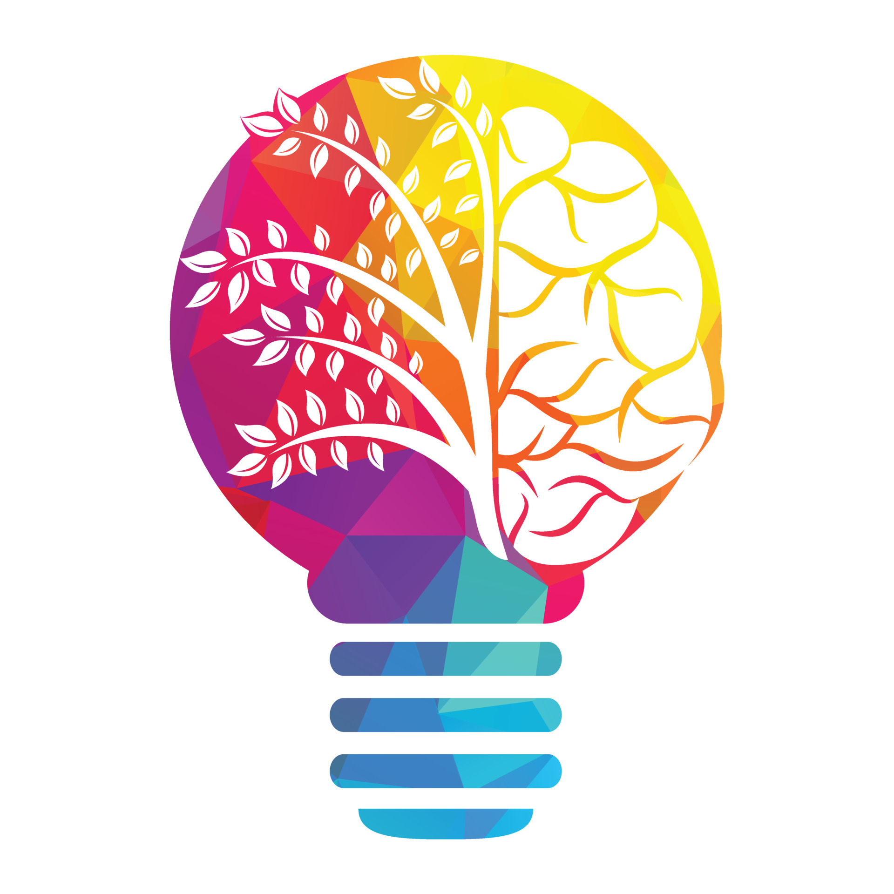

<!DOCTYPE html>
<html lang="en">
  <link rel="stylesheet" href="prtfolialter.css">

<head>
  <meta charset="UTF-8" />
  <meta name="viewport" content="width=device-width, initial-scale=1.0" />
  <title>Akbarsha</title>
<body>
    

      <a href="midi">MEDIUM</a>
      <a href="https://www.linkedin.com/in/akbarsha-n-0160782a1?utm_source=share&utm_campaign=share_via&utm_content=profile&utm_medium=android_app">LINKED IN</a>
      <a href="https://github.com/akbarsha8">GITHUB</a>
    

    
 <!--top header area-->
        <h1 class="topicname">Portfolio Website</h1>
        
This is Website is created by my own knowledge.

        

          <a href="https://www.instagram.com/mr.200watts?igsh=MWpwdXFyMXIxbzViag==">INSTA /</a>
          <a href="https://www.facebook.com/AkbarSmartking?mibextid=kFxxJD">FB</a>
        

    
 

    

    
  <!--my photo area-->
      
      <h2 class="myname">AKBARSHA N</h2> 
      <h3 class="picabvco">Iam Pursing BSc Computer Science with Cyber Security. I have basic knowledge of Cyber Security, Networking, Ethical Hacker, HTML & CSS.</h3>
    
 
  
 

  

  <!--after profile and bio-->
   
<section>
  <h2 class="uniqcerti">CERTIFICATIONS : &#x2B9B</h2>
   
    

        

            
            <h3>Cloud Computing and Distributed System</h3>
            
Issued by NPTEL

        

        

            
            <a href="https://www.credly.com/badges/f19ad534-bfbf-491c-9332-151aaf7f0ff1/public_url"><h3>Initiation to Cyber security</h3></a>
            
Issued by CISCO

        

        

          
          <h3>Network Security</h3>
          
Issued by Great Learning

      

    

      
      <a href="https://www.credly.com/badges/f66fbe2d-1141-4c45-b776-e057585afc86/public_url"><h3>Design Thinking</h3></a>
      
Issued by IBM

  

  

    
    <a href="https://www.linkedin.com/learning/certificates/62d7dc0cee7ee7897fad81d55963da5e43762688e7872ab75a68effa26f9cea4?trk=share_certificate"><h3>Digital Networking Strategies</h3></a>
    
Issued by LinkedIn

  
  <h3>Viksit Bharat Quiz</h3>
  
Issued by Viksit Bharat 2047

  
  <h3>AI Applications in the Transportation Industry</h3>
  
Issued by Computer Society of INDIA, Mumbai Chapter.

    

</section>

  
<section>

  <h4>DO YOU HIRE ME OR NOT??</h4>
  <button id="movingBtn">Sorry</button>
   

    <button class="btn" onclick="executeHack()">Yess</button>

Requested Granted...

</section>
</body>
</html>
